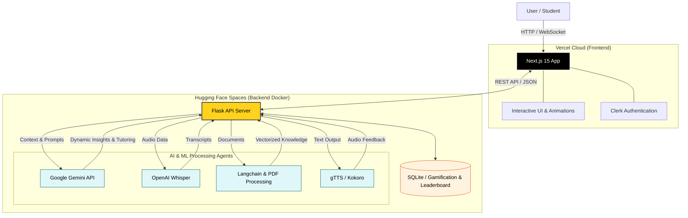

---

<div align="center">

*Transform any content into interactive, personalized learning experiences with AI*

[](https://github.com/Shreyyy07/Tayyari-AI-working-model)
[](https://github.com/Shreyyy07/Tayyari-AI-working-model/fork)
[](LICENSE)
[](https://www.docker.com/)

[Features](#-features) • [Architecture](#-system-architecture) • [Technologies](#-technologies-used) • [Roadmap](#-roadmap)

</div>

---

## 📖 About Tayyari.ai
**Tayyari.ai** is an advanced AI-driven educational platform designed to completely revolutionize how students and professionals learn. Instead of passively reading textbooks or watching videos, Tayyari allows you to upload any content and instantly transforms it into a highly interactive, personalized, and gamified learning experience.

Whether you need quick summaries, deep-dive explanations, interactive flashcards, or voice-based learning, Tayyari's suite of AI agents adapts entirely to your unique learning style.

<div align="center">
  
</div>

---

## 🏗️ System Architecture


---

## ✨ Features

#### **1. Multi-Agent AI Tutoring**
- **Dynamic Content Analysis:** Upload PDFs or text and let the AI instantly understand the context.
- **Specialized Agents:** Switch seamlessly between agents designed for Deep Dives, Flashcards, Summarization, and Q&A.
- **Audio Learning:** Built-in Speech-to-Text (Whisper) and Text-to-Speech (gTTS) for hands-free, conversational learning.

#### **2. Gamification & Progression**
- **Points System:** Earn XP and points for every interaction, question answered, and module completed.
- **Global Leaderboard:** Compete with other learners globally in real-time.
- **Achievement Tracking:** Visual progression that keeps you motivated to learn more every day.

<div align="center">
  
</div>

#### **3. Stunning, Accessible UI**
- **Rive Animations:** High-performance, interactive vector animations that respond to user input.
- **Responsive Design:** Beautifully crafted with Tailwind CSS and Framer Motion for a fluid experience on any device.
- **Secure Authentication:** Seamless and secure onboarding powered by Clerk.

---

## 💻 Tech Stack

### Frontend Stack (Vercel)
| Technology | Purpose |
|------------|---------|
| **Next.js 15** | React framework with Server Components and App Router |
| **TypeScript** | Type-safe JavaScript development |
| **Tailwind CSS** | Utility-first styling framework |
| **Framer Motion & Rive** | Smooth animations and interactive graphics |
| **Clerk** | Secure user authentication and management |

### Backend Stack (Hugging Face Spaces)
| Technology | Purpose |
|------------|---------|
| **Flask** | High-performance Python web framework for API |
| **SQLAlchemy** | ORM for managing Leaderboard and Gamification SQLite databases |
| **Gunicorn** | Production WSGI server containerized via Docker |
| **Google Gemini API** | Core LLM engine powering the intelligent tutoring agents |
| **Langchain & PyPDF** | Document ingestion, parsing, and context retrieval |
| **OpenAI Whisper** | Accurate audio transcription for voice inputs |

---

## 🚀 Getting Started

### Prerequisites
- Node.js (v18+)
- Python 3.11+
- Clerk API Keys
- Google Gemini API Key

### Installation

1. **Clone the repository**
   ```bash
   git clone https://github.com/Shreyyy07/Tayyari-AI-working-model.git
   cd Tayyari-AI-working-model
   ```

2. **Setup Frontend**
   ```bash
   npm install
   # Create a .env.local file with your Clerk keys and backend URL
   npm run dev
   ```

3. **Setup Backend**
   ```bash
   cd backend
   python -m venv venv
   source venv/bin/activate  # On Windows: venv\Scripts\activate
   pip install -r requirements.txt
   # Create a .env file with your Gemini API key
   python app.py
   ```

---

## 📈 Roadmap
- [x] Cloud Split-Stack Deployment (Vercel + Hugging Face)
- [x] Multi-Agent Architecture Integration
- [x] Live Global Leaderboard & Points System
- [ ] **Vector Database Integration** - Pinecone/ChromaDB for massive document support
- [ ] **Mobile Application** - iOS and Android native apps
- [ ] **Collaborative Study Rooms** - Real-time multiplayer learning sessions
- [ ] **Video Generation** - AI-generated video summaries of notes

---

## 🔐 Security & Privacy
- **Secure Processing**: ML models and heavy processing isolated securely in Hugging Face Docker containers.
- **Auth Management**: Enterprise-grade security handled entirely by Clerk.
- **API Security**: Environment variables and secure CORS policies strictly enforced.

---

## 🤝 Contributing
We welcome contributions! Here's how:

1. Fork the repository
2. Create a feature branch (`git checkout -b feature/amazing-feature`)
3. Commit your changes (`git commit -m 'Add amazing feature'`)
4. Push to the branch (`git push origin feature/amazing-feature`)
5. Open a Pull Request

---

## 📄 License
This project is licensed under the **MIT License** - see the [LICENSE](LICENSE) file for details.

---

## 👥 Author
- **Shreyyy07** - [GitHub Profile](https://github.com/Shreyyy07)

---

<div align="center">

**⭐ Star this repository if you find it helpful!**

Made with ❤️ by Shreyyy07

</div>
